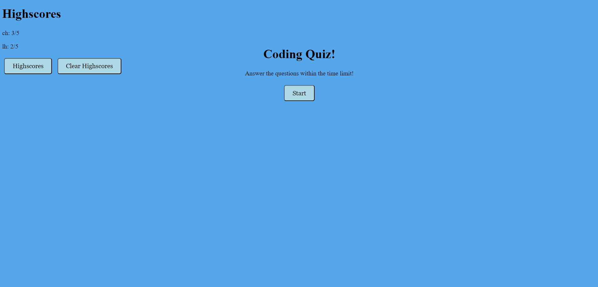
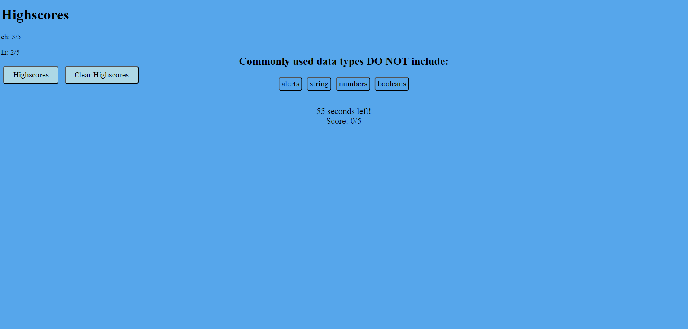

# JHtimeQ
This is a quiz app it asks you 5 questions, and you get 60 seconds to answer all the questions.
At the end you put in you name and you score is recorded.  You can try as many times as you want and ever clear you Highscores. 

Screenshot

I changed my code I decided to start all  over because my html css and javascript was long and to complicated so I decided to try again.
 

<!-- I added my  index.html file and the stylee.css file as well. 
I all ready stated some code.  Just basic html and some css.
I added a game.html file to the code which is the question html.
I coded the game.css for the game.
I added the questions and answers to the code in javaScript.
The questions also change when I refresh the screen not when I answer the question. 
I added a correct and incorrect answers when you get it right it flashes green when wrong it flashes red. -->